<div align="center">
  
# 🌾 AI AgriVision

### Intelligent Agricultural Decision Support Platform Powered by Artificial Intelligence

<p align="center">
  
  
  
  
  
</p>

<p align="center">
  
  
  
  
  
</p>

<p align="center">
  <b>Mansoura National University · Faculty of Engineering · AI Engineering Department</b><br/>
  <i>Graduation Project 2025–2026</i>
</p>

---

> **"From Diagnosis to Decision — One Intelligent Platform."**

</div>

---

## 📖 Table of Contents

- [Overview](#-overview)
- [Why AI AgriVision?](#-why-ai-agrivision)
- [Key Features](#-key-features)
- [System Architecture](#-system-architecture)
- [AI Modules](#-ai-modules)
  - [Module 1 — Plant Diagnosis](#-module-1--plant-diagnosis)
  - [Module 2 — AgriChat](#-module-2--agrichat)
  - [Module 3 — Fertilizer Recommendation](#-module-3--fertilizer-recommendation)
  - [Module 4 — Crop Yield Prediction](#-module-4--crop-yield-prediction)
  - [Module 5 — Early Warning System](#-module-5--early-warning-system)
  - [Module 6 — Cognitive AI Engine](#-module-6--cognitive-ai-engine)
- [Technology Stack](#-technology-stack)
- [Project Structure](#-project-structure)
- [Installation](#-installation)
- [Quick Start](#-quick-start)
- [REST API Reference](#-rest-api-reference)
- [Research Contributions](#-research-contributions)
- [Roadmap](#-roadmap)
- [Team](#-team)
- [Citation](#-citation)
- [License](#-license)

---

## 🌍 Overview

### 🌾 Overview of Egyptian Agriculture
<p align="center">
  
</p>

---

**AI AgriVision** is a next-generation intelligent agricultural platform that unifies six specialized AI systems into one cohesive ecosystem.

The project was developed as a graduation project for the **Artificial Intelligence Engineering Program** at **Mansoura National University** to address the major challenges facing agriculture in Egypt and the broader Arab world.

Unlike traditional agricultural applications that solve a single problem, AI AgriVision integrates:

| Technology | Role |
|---|---|
| 🔬 Computer Vision | Plant disease, pest & nutrient deficiency detection |
| 🧠 Explainable AI (XAI) | GradCAM, Saliency Maps, Feature Visualization |
| 💬 Large Language Models | Bilingual agricultural chatbot (Arabic & English) |
| 📚 Hybrid RAG | Knowledge-grounded, citation-based answers |
| 🕸 Knowledge Graphs | Semantic reasoning & multi-hop inference |
| 🌦 Environmental Monitoring | NDVI, satellite imagery & early warnings |
| 📈 Machine Learning | Yield prediction & climate scenario analysis |
| 🤖 Cognitive Layer | Rule-based expert system & decision support |

> The system operates **completely offline** using local AI inference without relying on commercial cloud APIs — ensuring **privacy**, **scalability**, and **low operational cost**.

---

## ❓ Why AI AgriVision?

Most agricultural AI solutions are isolated:

```
❌  Disease detection only
❌  Chatbot only
❌  Yield prediction only
❌  Fertilizer recommendation only
```

**AI AgriVision changes this:**

```
✅  All of the above — unified into ONE intelligent platform
✅  Modules communicate via REST APIs
✅  Explainable decisions at every step
✅  Arabic & Egyptian dialect support
✅  Fully offline — no cloud dependency
```

---

## 🌟 Key Features

<table>
<tr>
<td>

**🌿 Smart Plant Diagnosis**
- Disease Classification
- Pest Detection
- Nutrient Deficiency Analysis
- Multi-Class CNN Model
- Grad-CAM Explainability
- Automated Diagnosis Report

</td>
<td>

**💬 AgriChat (Bilingual)**
- Arabic / English / Egyptian Dialect
- Hybrid RAG Architecture
- Knowledge Graph Reasoning
- Context Memory
- Streaming Responses
- Citation-based Answers

</td>
</tr>
<tr>
<td>

**🌾 Fertilizer Recommendation**
- Soil Analysis Input
- NPK-based Suggestions
- Seasonal & Crop-aware Advice
- Fine-tuned Mistral-7B (QLoRA)
- Explainable Output

</td>
<td>

**📈 Crop Yield Prediction**
- Historical FAOSTAT Data
- Climate Scenario Simulation
- Ensemble ML Models
- Feature Importance Ranking
- Visualization Dashboard

</td>
</tr>
<tr>
<td>

**🛰 Early Warning System**
- Sentinel-2 / Landsat / MODIS
- NDVI Vegetation Monitoring
- Stress Detection Alerts
- Protected Area Surveillance

</td>
<td>

**🧠 Cognitive AI Engine**
- Differential Diagnosis
- Rule-Based Expert System
- Knowledge Graph Traversal
- Multi-hop Inference
- Treatment Recommendations

</td>
</tr>
</table>

---
# 📸 AI-AgriVision Screenshots

This folder contains all screenshots and visual assets for the AI-AgriVision project.
These images demonstrate the system modules and AI interfaces.

---
## 🏠 Homepage
<p align="center">
  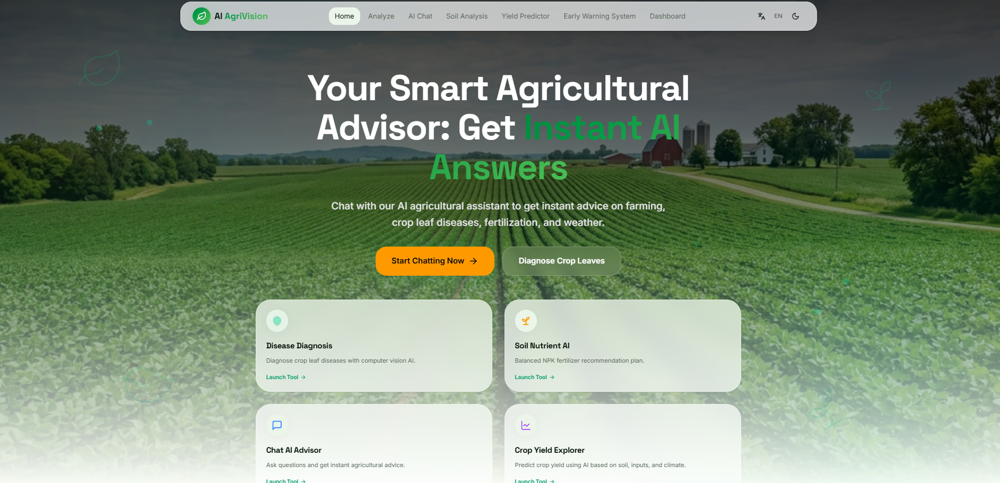
</p>

---
## 🌿 Plant Disease Diagnosis
<p align="center">
  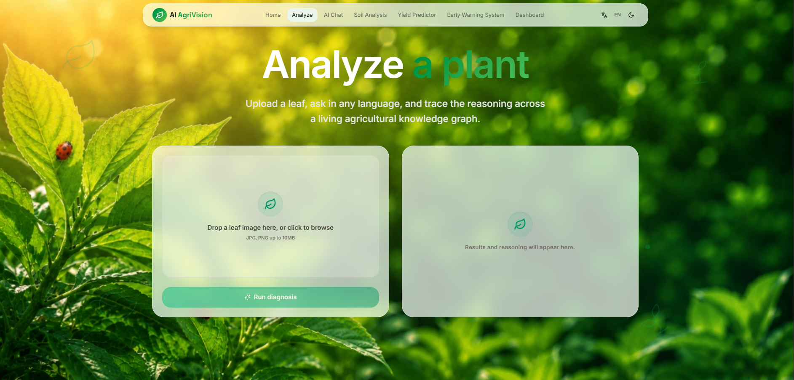
</p>
---

## 💬 AI Chat Assistant
<p align="center">
  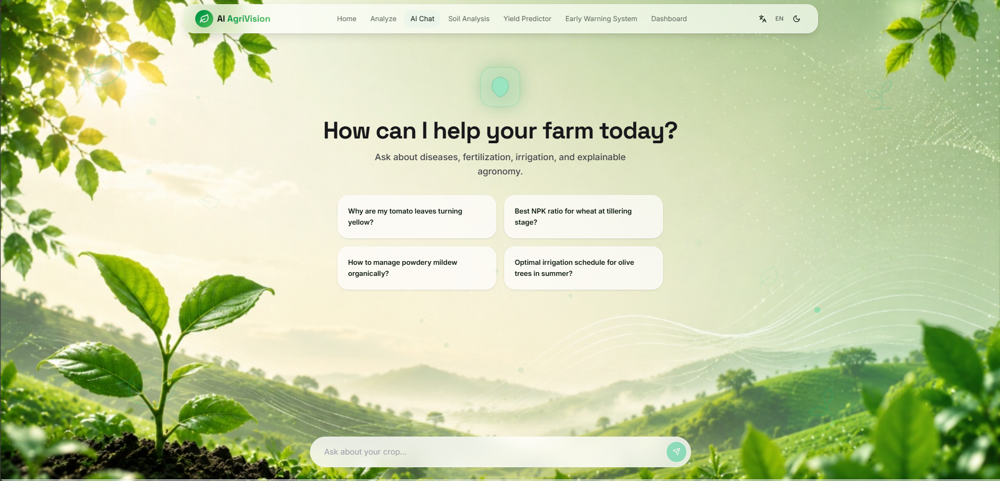
</p>

---

## 🌱 Soil Analysis System
<p align="center">
  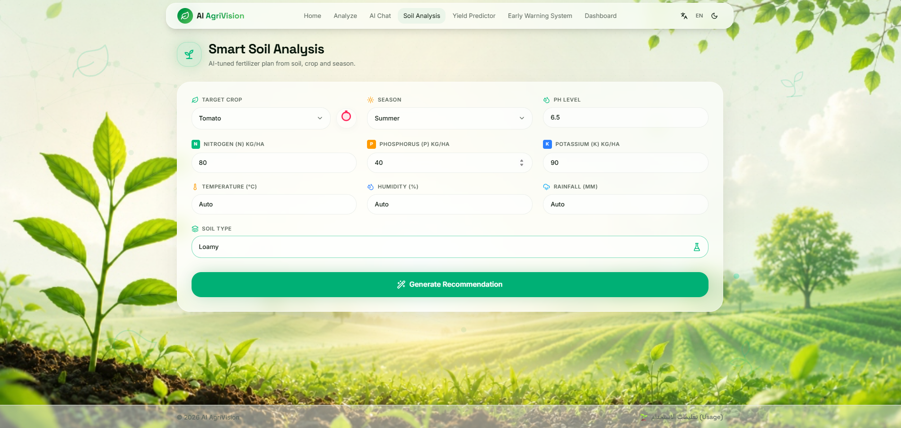
</p>

---

## 📈 Crop Yield Prediction
<p align="center">
  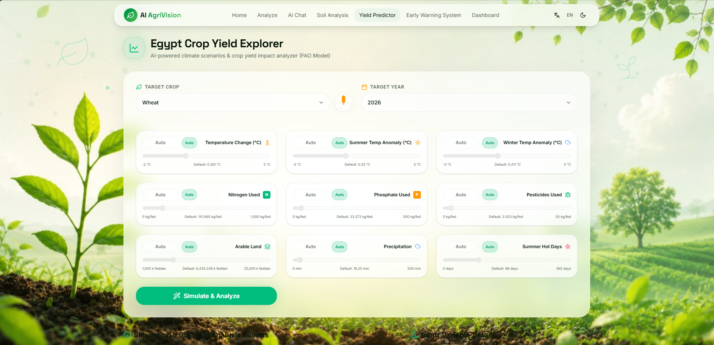
</p>

---

## ⚠️ Early Warning System Dashboard
<p align="center">
  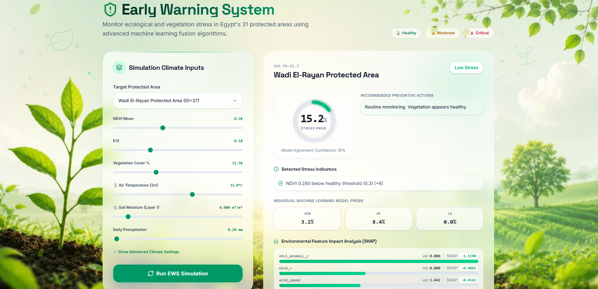
</p>

---

## 📄 Graduation Project Report

<p align="center">
  📘 Full Graduation Book for AI-AgriVision Project
</p>

<p align="center">
  👉 <a href="docs/AI_AgriVision.pdf"><b>📥 Open / Download Full Book</b></a>
</p>

---

### 📌 The report includes:
- 🧠 AI system architecture  
- 🌱 Plant disease detection models  
- 📊 Soil & yield analysis  
- ⚠️ Early warning system design  
- 🚀 Full implementation details  

👉 [📥 Open Full Thesis](docs/AI_AgriVision.pdf)
---

## 🎯 Purpose

These images are used in the main project README to visually demonstrate:
- System functionality
- AI modules
- User interfaces
- Overall project workflow

---

## 📌 Note

Do not modify or delete these images unless updating the project documentation.

All images are used in the main repository README for presentation purposes.

## 🏗 System Architecture

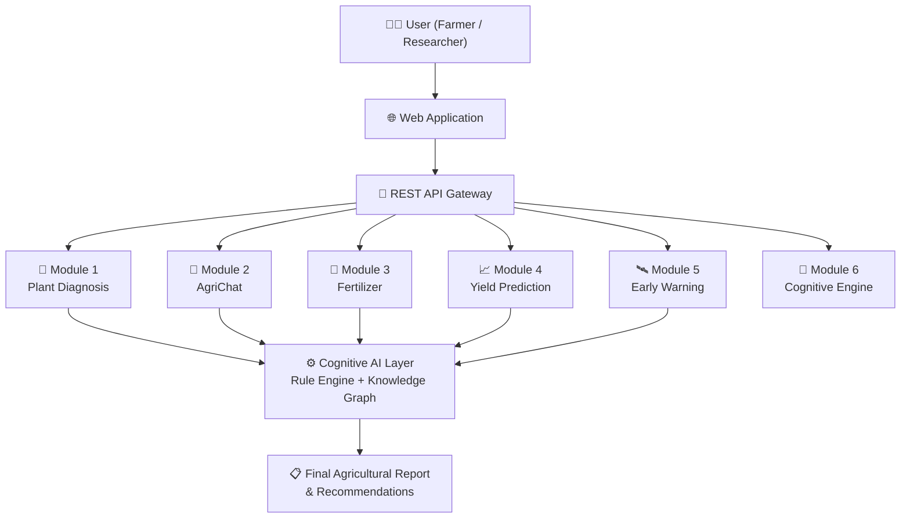

The **modular microservices design** allows each AI module to be developed, tested, deployed, and scaled independently — without affecting the others.

---

## 🤖 AI Modules

### 🌿 Module 1 — Plant Diagnosis

> Automatically identifies plant diseases, pests, and nutrient deficiencies from leaf images using deep learning and explainability.

#### Architecture

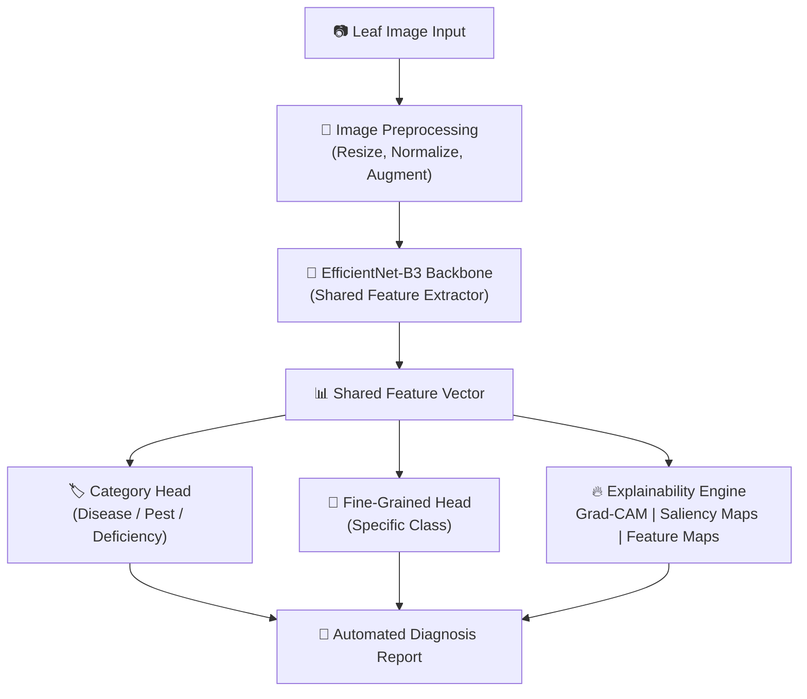

### 🌿 Plant Diagnosis Architecture
<p align="center">
  
</p>

---

#### Supported Classes

| Category | Examples |
|---|---|
| 🦠 Diseases | Apple Scab, Early Blight, Late Blight, Leaf Mold, Powdery Mildew, Mosaic Virus, Rust |
| 🐛 Pests | Aphids, Whiteflies, Spider Mites, Armyworms, Thrips |
| 🟡 Nutrient Deficiencies | Nitrogen (N), Phosphorus (P), Potassium (K), Magnesium (Mg), Zinc (Zn), Iron (Fe) |
| ✅ Healthy | Normal healthy leaf (control class) |

#### Explainability Features
- 🔥 **Grad-CAM** — heatmap highlighting the exact leaf regions triggering the prediction
- 🗺 **Saliency Maps** — pixel-level sensitivity visualization
- 📊 **Feature Maps** — intermediate CNN layer outputs
- 📐 **Confidence Gap Analysis** — flags uncertain or ambiguous predictions
- 📋 **Automated Report** — structured diagnosis PDF per prediction

---

### 💬 Module 2 — AgriChat

> A bilingual agricultural assistant powered by Hybrid RAG — combining FAISS vector search, Knowledge Graph reasoning, and a local LLM.

#### Architecture

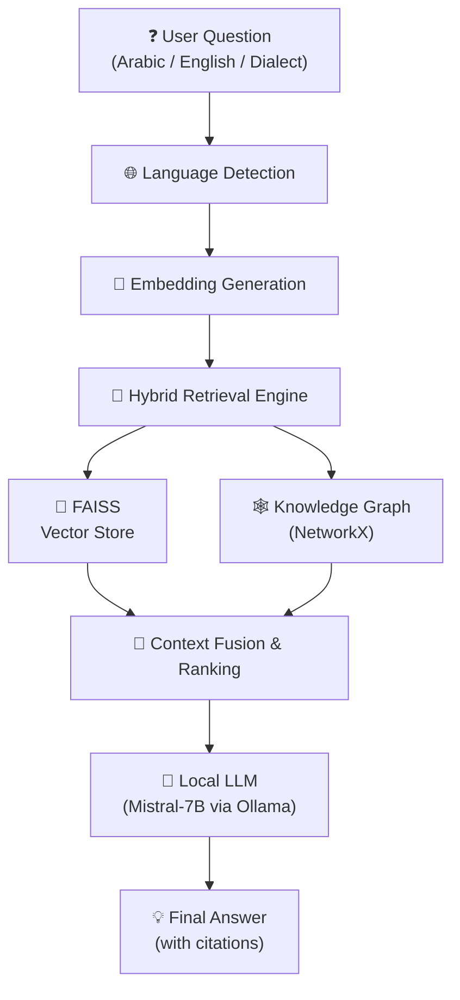

### 🏗️ AgriChat Architecture
<p align="center">
  
</p>

---

#### Retrieval Pipeline

| Step | Action |
|------|--------|
| 1 | Language Detection (Arabic / English / Dialect) |
| 2 | Query Embedding Generation |
| 3 | FAISS Semantic Search |
| 4 | Knowledge Graph Traversal |
| 5 | Context Ranking & Fusion |
| 6 | Prompt Construction |
| 7 | LLM Generation (Mistral-7B) |
| 8 | Response Validation & Citation |

#### Supported Languages
- 🇪🇬 **Egyptian Arabic Dialect**
- 🌍 **Modern Standard Arabic (MSA)**
- 🇺🇸 **English**

---

### 🌾 Module 3 — Fertilizer Recommendation

> Provides personalized, context-aware fertilizer advice using a fine-tuned Large Language Model trained on Egyptian agricultural data.

#### Architecture

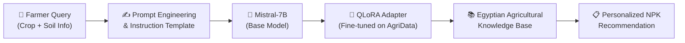

#### What Makes It Better Than Rule-based Systems?

| Traditional Rules | AI AgriVision LLM |
|---|---|
| Fixed predefined outputs | Dynamic, context-aware responses |
| English only | Arabic + English |
| No explanation | Full explanation of each recommendation |
| One-size-fits-all | Crop-specific, season-specific |
| No LLM reasoning | Reasoning backed by fine-tuned LLM |

---

### 📈 Module 4 — Crop Yield Prediction

> Estimates future agricultural production using historical data, weather indicators, and climate scenarios with an ensemble of ML models.

#### Prediction Pipeline

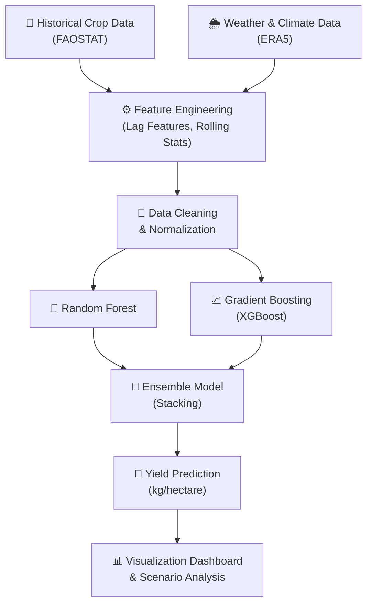

#### Supported Features
- 🌾 Multi-crop support (wheat, corn, rice, cotton, etc.)
- 🌍 Climate scenario simulation (drought, flooding, optimal)
- 📊 Feature importance ranking (SHAP values)
- 📅 Historical trend analysis
- 🔮 Future production forecasting

---

### 🛰 Module 5 — Early Warning System

> Continuously monitors vegetation health across protected areas using satellite imagery and machine learning to detect stress before it becomes visible.

#### Data Sources

| Satellite | Resolution | Use |
|---|---|---|
| 🛰 Sentinel-2 | 10m | NDVI, vegetation index |
| 🛰 Landsat-8/9 | 30m | Long-term trend analysis |
| 🛰 MODIS | 500m | Wide-area monitoring |
| 🌦 ERA5 | Climate | Temperature, rainfall |

#### AI Pipeline

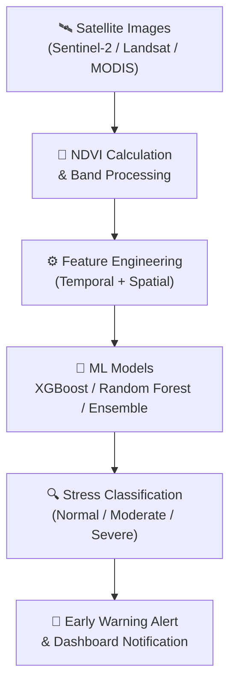

---

### 🧠 Module 6 — Cognitive AI Engine

> The reasoning brain of AI AgriVision — combines symbolic AI, expert rules, and Knowledge Graph traversal to produce explainable recommendations.

#### Cognitive Pipeline

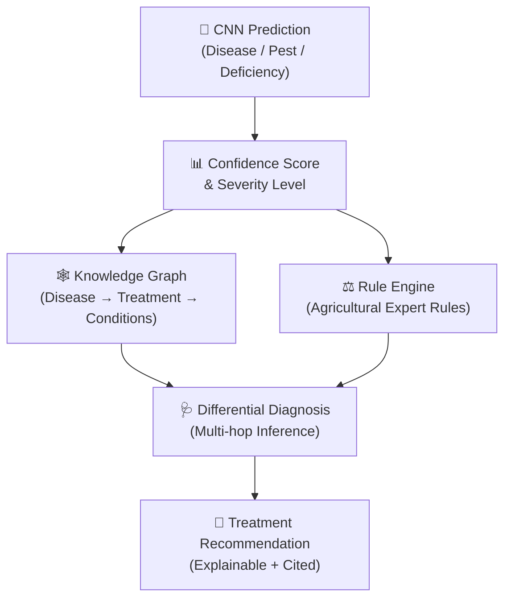

#### Rule Engine Examples

| Rule | Condition | Action |
|---|---|---|
| Disease Severity | Confidence > 85% + Large Area | Recommend fungicide immediately |
| Irrigation | Stress detected + Temperature > 35°C | Adjust irrigation schedule |
| Fertilizer | N deficiency + Low NDVI | Recommend nitrogen boost |
| Weather | Rain forecasted | Delay pesticide application |
| Growth Stage | Seedling + Disease | Use preventive biocontrol |

---

## 💻 Technology Stack

### 🧠 AI & Machine Learning

| Category | Technologies |
|---|---|
| Deep Learning | PyTorch, TensorFlow, EfficientNet-B3 |
| Classical ML | Scikit-learn, XGBoost, Random Forest, Gradient Boosting |
| LLM | Mistral-7B, QLoRA Fine-tuning, Ollama |
| Embeddings | Sentence Transformers, HuggingFace Transformers |
| Explainability | GradCAM, SHAP, Saliency Maps |

### 📚 Retrieval & Knowledge

| Category | Technologies |
|---|---|
| Vector Search | FAISS |
| Knowledge Graph | NetworkX |
| RAG | Hybrid RAG (Semantic + Graph) |
| Databases | SQLite, JSON, FAISS Index |

### 🌐 Backend & Deployment

| Category | Technologies |
|---|---|
| API Framework | FastAPI, Flask |
| Server | Uvicorn |
| Containerization | Docker |
| Computer Vision | OpenCV, Pillow |
| Data Processing | NumPy, Pandas, Matplotlib |

### 🎨 Frontend

| Category | Technologies |
|---|---|
| Core | TypeScript, HTML, CSS |
| Build Tool | Vite / Lovable |

---

## 📁 Project Structure

```
AI-AgriVision/
│
├── 📂 src/                        # Frontend source code (TypeScript/React)
│   ├── components/
│   ├── pages/
│   └── utils/
│
├── 📂 Models/                     # Trained AI model files & configs
│   ├── plant_diagnosis/
│   │   └── efficientnet_b3.pth
│   ├── llm/
│   │   └── mistral_qlora_adapter/
│   ├── yield/
│   └── ews/
│
├── 📂 Project_Config/             # Project-level configuration files
│
├── 📂 public/                     # Static frontend assets
│
├── 📂 .lovable/                   # Lovable platform config
│
├── api/                           # REST API endpoint definitions
│   ├── predict.py                 # Plant diagnosis endpoint
│   ├── chat.py                    # AgriChat endpoint
│   ├── fertilizer.py              # Fertilizer recommendation endpoint
│   ├── yield_api.py               # Yield prediction endpoint
│   ├── ews.py                     # Early warning endpoint
│   └── recommend.py               # Cognitive recommendation endpoint
│
├── backend/
│   ├── cnn/                       # EfficientNet model & inference
│   ├── rag/                       # Hybrid RAG pipeline
│   ├── llm/                       # LLM interface & prompting
│   ├── yield/                     # Yield prediction pipeline
│   ├── ews/                       # Early warning pipeline
│   └── cognitive/                 # Rule engine & knowledge graph
│
├── datasets/                      # Training & evaluation datasets
├── notebooks/                     # Jupyter notebooks (experiments)
├── docs/                          # Documentation
├── app.py                         # Flask application entry point
├── main.py                        # FastAPI application entry point
├── requirements.txt               # Python dependencies
├── .gitattributes
└── README.md
```

---

## ⚙️ Installation

### Prerequisites

- Python 3.11+
- Git
- [Ollama](https://ollama.ai/) (for local LLM inference)
- Docker (optional, for containerized deployment)

### Step 1 — Clone the Repository

```bash
git clone https://github.com/Mohamed-oosama/AI-AgriVision.git
cd AI-AgriVision
```

### Step 2 — Create a Virtual Environment

```bash
python -m venv venv
```

**Windows:**
```bash
venv\Scripts\activate
```

**Linux / macOS:**
```bash
source venv/bin/activate
```

### Step 3 — Install Dependencies

```bash
pip install -r requirements.txt
```

### Step 4 — Pull the LLM Model (via Ollama)

```bash
ollama pull mistral
```

### Step 5 — Run the Backend

**Option A — FastAPI:**
```bash
uvicorn main:app --reload
```

**Option B — Flask:**
```bash
python app.py
```

### Step 6 — Access the Application

```
http://127.0.0.1:8000
```

---

## 🚀 Quick Start

```python
import requests

# 🌿 Plant Disease Diagnosis
with open("leaf_image.jpg", "rb") as f:
    response = requests.post(
        "http://127.0.0.1:8000/predict",
        files={"image": f}
    )
print(response.json())
# Output: {"disease": "Early Blight", "confidence": 0.94, "gradcam": "..."}

# 💬 AgriChat
response = requests.post(
    "http://127.0.0.1:8000/chat",
    json={"question": "ما هي أسباب اصفرار أوراق الطماطم؟", "language": "ar"}
)
print(response.json())
# Output: {"answer": "...", "sources": [...], "language": "ar"}

# 🌾 Fertilizer Recommendation
response = requests.post(
    "http://127.0.0.1:8000/fertilizer",
    json={"crop": "wheat", "soil_ph": 6.5, "nitrogen": "low", "season": "winter"}
)
print(response.json())
# Output: {"recommendation": "...", "npk": {"N": 120, "P": 60, "K": 80}}
```

---

## 🔌 REST API Reference

| Endpoint | Method | Module | Description |
|---|---|---|---|
| `/predict` | `POST` | Plant Diagnosis | Upload leaf image → get disease/pest/deficiency prediction with GradCAM |
| `/chat` | `POST` | AgriChat | Send agricultural question in Arabic/English → get cited answer |
| `/fertilizer` | `POST` | Fertilizer | Send soil + crop info → get NPK fertilizer recommendations |
| `/yield` | `POST` | Yield Prediction | Send historical + climate data → get yield forecast |
| `/ews` | `POST` | Early Warning | Send satellite imagery data → get vegetation stress alert |
| `/recommend` | `POST` | Cognitive Engine | Send CNN prediction → get explainable treatment recommendation |

---

## 📚 Research Contributions

AI AgriVision makes the following original contributions to agricultural AI:

| # | Contribution |
|---|---|
| 1 | **Multi-Module Unified Platform** — Six AI systems integrated into one ecosystem |
| 2 | **Explainable Plant Disease Diagnosis** — GradCAM + Saliency Maps for every prediction |
| 3 | **Hybrid RAG for Arabic Agriculture** — Combining FAISS + Knowledge Graph for Arabic agricultural QA |
| 4 | **Fine-tuned Arabic Agricultural LLM** — Mistral-7B with QLoRA for Egyptian agricultural context |
| 5 | **Climate-Aware Yield Prediction** — Ensemble ML with climate scenario simulation |
| 6 | **Vegetation Stress Early Warning** — Multi-satellite NDVI-based stress detection |
| 7 | **Offline AI Deployment** — Full local inference without cloud dependency |
| 8 | **Arabic & Egyptian Dialect NLP** — Supporting both MSA and colloquial Egyptian Arabic |
| 9 | **RESTful Microservice Architecture** — Independent, scalable, interoperable AI modules |

---

## 🛣 Roadmap

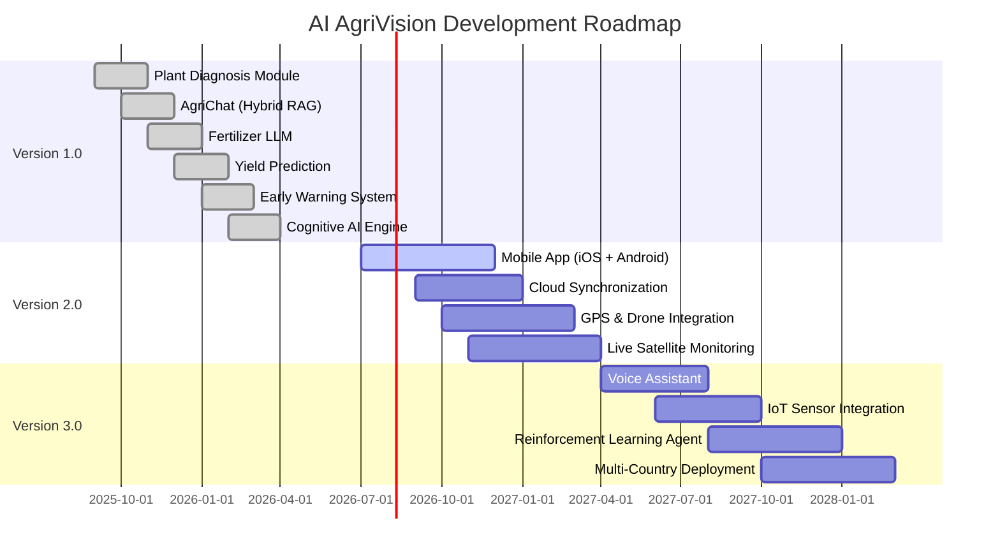

---

## 👨‍💻 Team

| Name | Role |
|---|---|
| Ibrahim Mohamed Amin | AI Engineer |
| Badr Islam Elawa | AI Engineer |
| Mohamed Osama Kamel | AI Engineer |
| Mohamed Ashraf ElDanen | AI Engineer |
| Mohamed Ali Shatla | AI Engineer |
| Mahmoud Ashraf Hosny | AI Engineer |

### 👨‍🏫 Supervisors

| Name | Role |
|---|---|
| Dr. Mohamed Zaki | Academic Supervisor |
| Eng. Mennatallah Awf | Technical Supervisor |

**Institution:** Faculty of Engineering, Mansoura National University

---

## 📖 Citation

If this project contributes to your research, please cite:

```bibtex
@misc{AIAgriVision2026,
  title     = {AI AgriVision: Intelligent Agricultural Decision Support Platform},
  author    = {
    Ibrahim Mohamed Amin and
    Badr Islam Elawa and
    Mohamed Osama Kamel and
    Mohamed Ashraf ElDanen and
    Mohamed Ali Shatla and
    Mahmoud Ashraf Hosny
  },
  year      = {2026},
  institution = {Mansoura National University},
  department  = {Faculty of Engineering, AI Engineering Program},
  type      = {Graduation Project}
}
```

---

## 🙏 Acknowledgments

Special thanks to:

- 🏛 **Mansoura National University** — Faculty of Engineering
- 🌐 **FAO** — Food and Agriculture Organization (data & knowledge)
- 🌿 **PlantVillage** — Plant disease dataset
- 📊 **Kaggle Community** — Additional datasets
- 🤗 **Hugging Face** — Transformers & model hub
- 🔥 **PyTorch Team** — Deep learning framework
- 🌍 **Open-source AI community** — Tools and libraries

---

# Contributing

Contributions are welcome! To contribute:

1. Fork the repository.
2. Create a new branch:
   ```bash
   git checkout -b feature/your-feature
   ```
3. Commit your changes:
   ```bash
   git commit -m "Add: your feature description"
   ```
4. Push to your branch:
   ```bash
   git push origin feature/your-feature
   ```
5. Open a Pull Request and describe your changes.

Please follow the existing code style and add docstrings to new functions.

---

## Contributors

We would like to sincerely thank everyone who contributed to the development of this project:

**Mohamed Ali Shatla** – https://github.com/Mohamed-Ali-Shatla

**Ibrahim Amin** – https://github.com/ibrahim-amin0

**Badr** – https://github.com/badr00000

**Mohamed Osama** –   https://github.com/Mohamed-oosama

**Mahmoud Ashraf Hosny** –   https://github.com/mahmoudashrafhosny

## 📄 License

This project is licensed under the **MIT License**.
You are free to use, modify, and distribute this project under the terms of the license.

See the [LICENSE](LICENSE) file for full details.

---

## 📬 Contact

For questions, suggestions, or collaborations:

## 👥 Contributors

| Name | LinkedIn |
|------|----------|
| Mohamed Osama | [Profile](https://www.linkedin.com/in/mohamed-osama-kamel/) |
| Badr Islam | [Profile](https://www.linkedin.com/in/badr-islam-4881b12a4/ar/) |
| Mohamed Ali Shatla | [Profile](https://www.linkedin.com/in/mohamed-ali-shatla-88734b362/) |
| Ibrahim Amin | [Profile](https://www.linkedin.com/in/ibrahim-amin-aie0101010101/) |
| Mahmoud Ellakany | [Profile](https://www.linkedin.com/in/mahmoud-ashraf-hosny/) |
| Mohammed Ashraf | [Profile](https://www.linkedin.com/in/mohammed-ashraf-449a782a3/) |

---

<div align="center">

**⭐ If you found this project useful, please star the repository — it helps reach more developers and researchers!**

<br/>

Made with ❤️ by the **AI AgriVision Team**

© 2026 AI AgriVision · Mansoura National University · All Rights Reserved.

</div>
